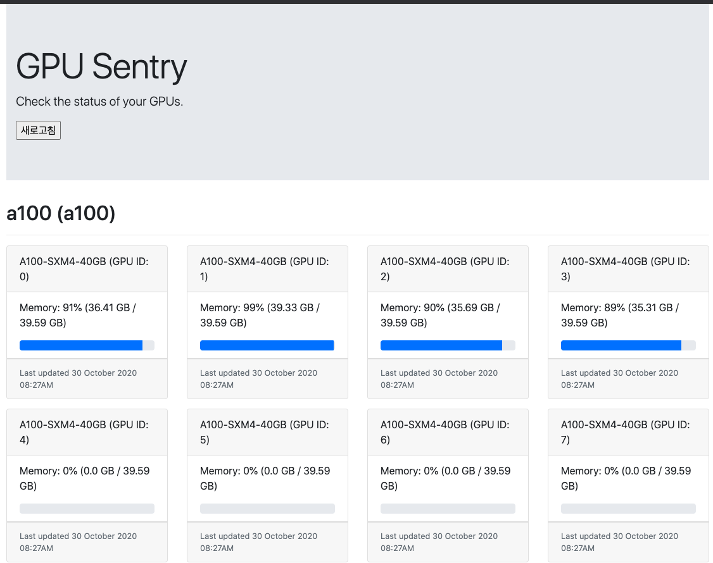

# gpu-sentry
Nvidia GPU 사용량을 모니터링할 수 있는 Flask 기반의 페이지



## Motivation
nvidia-smi 커맨드를 일일이 입력하여 확인하는 것을 대신하기 위해, 확인하고 싶은 GPU 서버위에 클라이언트를 구동하여
서버에 주기적으로 GPU 사용량을 전달. 서버는 클라이언트로부터 받은 정보를 이용, 단일 웹페이지에 게시.


## Installation
Run `pip install -e .` 를 통해 dependencies와 package 설치

## Configuration
1. `config.py`
`PERMIT_CLIENTS = {}` 에 dictionary 형태로 서버에서 허용할 client의 hostname 입력 (name, codename은 선택사항)
```
PERMIT_CLIENTS = {
    "hostisZero": {
        "codename": "root",
        "name": "(hostname1)",
    },
}
```
`CLIENT_TIMEOUT` Client에서 Server로 GPU stats을 Post하는 주기 설정
`SERVER_HOSTNAME`  Client가 Post한 GPU stats 받을 서버주소 설정 (/api로 설정해줘야 post받을 수 있음)
`SERVER_PORT` 개방할 포트번호

2. `client.py`
`requests.post` Json 정보 받을 서버 주소 입력


## Running
백그라운드 프로세스로 돌리기 위해서 `screen`, `tmux`, `wsgi` or `docker` 사용

- Server
```
python cli.py -m server
```

- Client
```
python cli.py -m client --hostname <config/PERMIT_CLIENTS/hostname> --name <name> --codename <codename>
```
`config.py에서 codename, name을 설정하지 않았어도 client 설정시에는 입력해주어야 작동`

## Reference
```
https://github.com/jacenkow/gpu-sentry
```
- 기본 템플릿과 기능 활용
- 추가한 내용
1. 새로고침 기능
2. parse 사용하여 client, server 연결이 쉽게 기능 구현
3. html상에서 보이는 gpu 정보 갯수 수정(직관적으)


